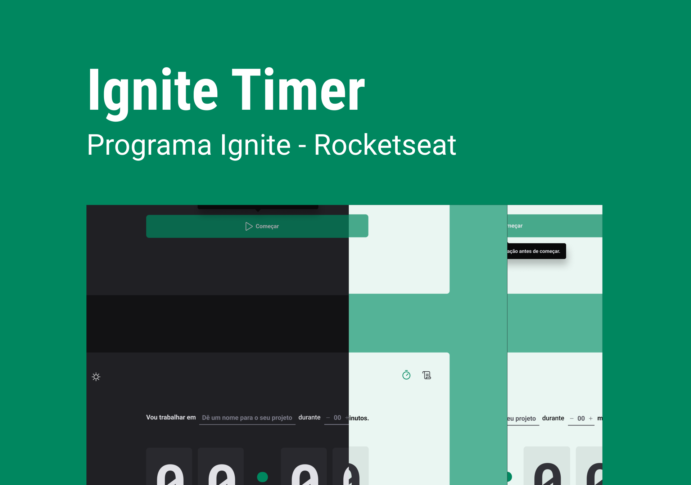

<h1 align="center"> Timer </h1>

  <a href="#-tecnologias">Tecnologias</a>&nbsp;&nbsp;&nbsp;|&nbsp;&nbsp;&nbsp;
  <a href="#-projeto">Projeto</a>&nbsp;&nbsp;&nbsp;|&nbsp;&nbsp;&nbsp;
  <a href="#-layout">Layout</a>&nbsp;&nbsp;&nbsp;|&nbsp;&nbsp;&nbsp;
  <a href="#memo-licença">Licença</a>

  

 

  

## 🚀 Tecnologias

Esse projeto foi desenvolvido com as seguintes tecnologias:

- HTML e CSS
- JavaScript
- Reactjs
- Type Script
- Git e Github
- Figma

## 💻 Projeto

Timer é uma aplicação para marcar o tempo de no mínimo 5 minutos e no máximo de 60 minutos com histórico e status, podendo ser usado para estudar ou realizar tarefas que precisem marcar o tempo. 

## 🔖 Layout

Você pode visualizar o layout do projeto através [DESSE LINK](https://www.figma.com/file/yQG4jpFLvkD29Hezlj7L9c/Ignite-Timer-(Community)?type=design&node-id=0-1&mode=design&t=8BcmNHK3f4fx1oOy-0) É necessário ter conta no [Figma](https://figma.com) para acessá-lo.

## :memo: Licença

Esse projeto está sob a licença MIT.

---

Feito a partir das aulas da Rocketseat [Ignit aulas](https://app.rocketseat.com.br/node/projeto-02/group/estrutura-da-aplicacao-4/lesson/introducao-36)